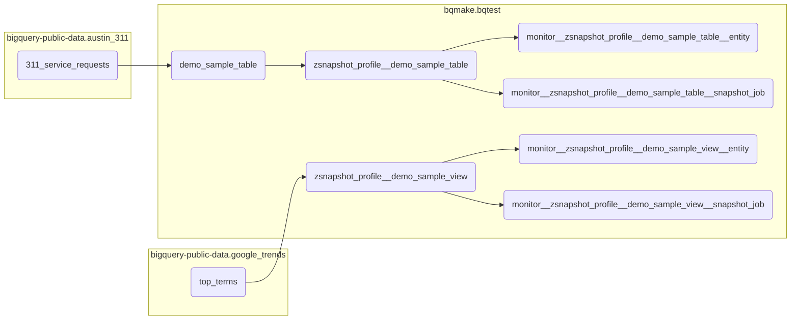

<!--- BQMAKE_DATASET: BEGIN -->

```mermaid
graph LR
subgraph bqmake.bqtest
	1+1w(demo_sample_table)
	xksx(monitor__zsnapshot_profile__demo_sample_table__entity)
	Gtda(zsnapshot_profile__demo_sample_table)
	lhos(monitor__zsnapshot_profile__demo_sample_table__snapshot_job)
	leEX(monitor__zsnapshot_profile__demo_sample_view__entity)
	TIeN(zsnapshot_profile__demo_sample_view)
	F3Xr(monitor__zsnapshot_profile__demo_sample_view__snapshot_job)
end
subgraph bigquery-public-data.austin_311
	CNg3(311_service_requests)
end
subgraph bigquery-public-data.google_trends
	1imV(top_terms)
end
CNg3 --> 1+1w
Gtda --> xksx
1+1w --> Gtda
Gtda --> lhos
TIeN --> leEX
1imV --> TIeN
TIeN --> F3Xr
```
<!--- BQMAKE_DATASET: END -->