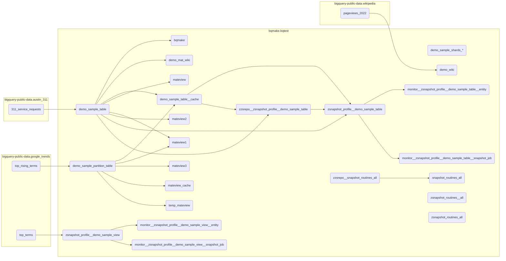

## BigQuery Testing Tools

### Instalation sql generator into your dataset

```sql
-- In demo examle
call `bqmake.bqtest.init__bqtest_dataset`(("<your_project>", "<your_dataset>"));
```

### DBT-like testing

```sql
-- In demo examle
execute immediate `bqtest.zbqt_gensql__table_spec`(
"demo_sample_table"
, [
    (null,
    -- unique keys
    ["unique_key"]
    -- non-null columns
    , if(false, [''], [])
    -- Check column value
    , if(false, [('', [''])], []))
  ]
);

-- In your dataset
execute immediate `<your_project>.<your_dataset>.zbqt_gensql__table_spec`(
"demo_sample_table"
, [
    (null,
    -- unique keys
    ["unique_key"]
    -- non-null columns
    , if(false, [''], [])
    -- Check column value
    , if(false, [('', [''])], []))
  ]
);
```


## Example lineage

<!--- BQMAKE_DATASET: BEGIN -->

<!--- BQMAKE_DATASET: END -->