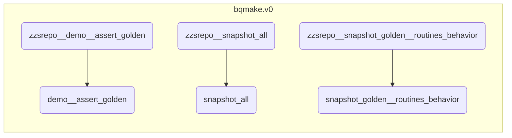

<!--- BQMAKE_DATASET: BEGIN -->

```mermaid
graph LR
subgraph bqmake.v0
	YU88(demo__assert_golden)
	Jo7E(zzsrepo__demo__assert_golden)
	Vc+T(snapshot_all)
	t0qd(zzsrepo__snapshot_all)
	EIy0(snapshot_golden__routines_behavior)
	R8Gh(zzsrepo__snapshot_golden__routines_behavior)
end
Jo7E --> YU88
t0qd --> Vc+T
R8Gh --> EIy0
```
<!--- BQMAKE_DATASET: END -->