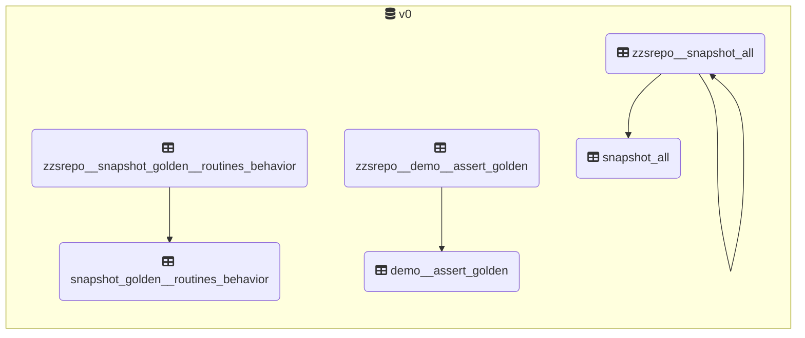

<!--- BQMAKE_DATASET: BEGIN -->

```mermaid
graph LR
subgraph "fa:fa-database v0"
	EIy0(fa:fa-table snapshot_golden__routines_behavior)
	Jo7E(fa:fa-table zzsrepo__demo__assert_golden)
	R8Gh(fa:fa-table zzsrepo__snapshot_golden__routines_behavior)
	Vc+T(fa:fa-table snapshot_all)
	YU88(fa:fa-table demo__assert_golden)
	t0qd(fa:fa-table zzsrepo__snapshot_all)
end
Jo7E --> YU88
R8Gh --> EIy0
t0qd --> Vc+T
t0qd --> t0qd
```
<!--- BQMAKE_DATASET: END -->